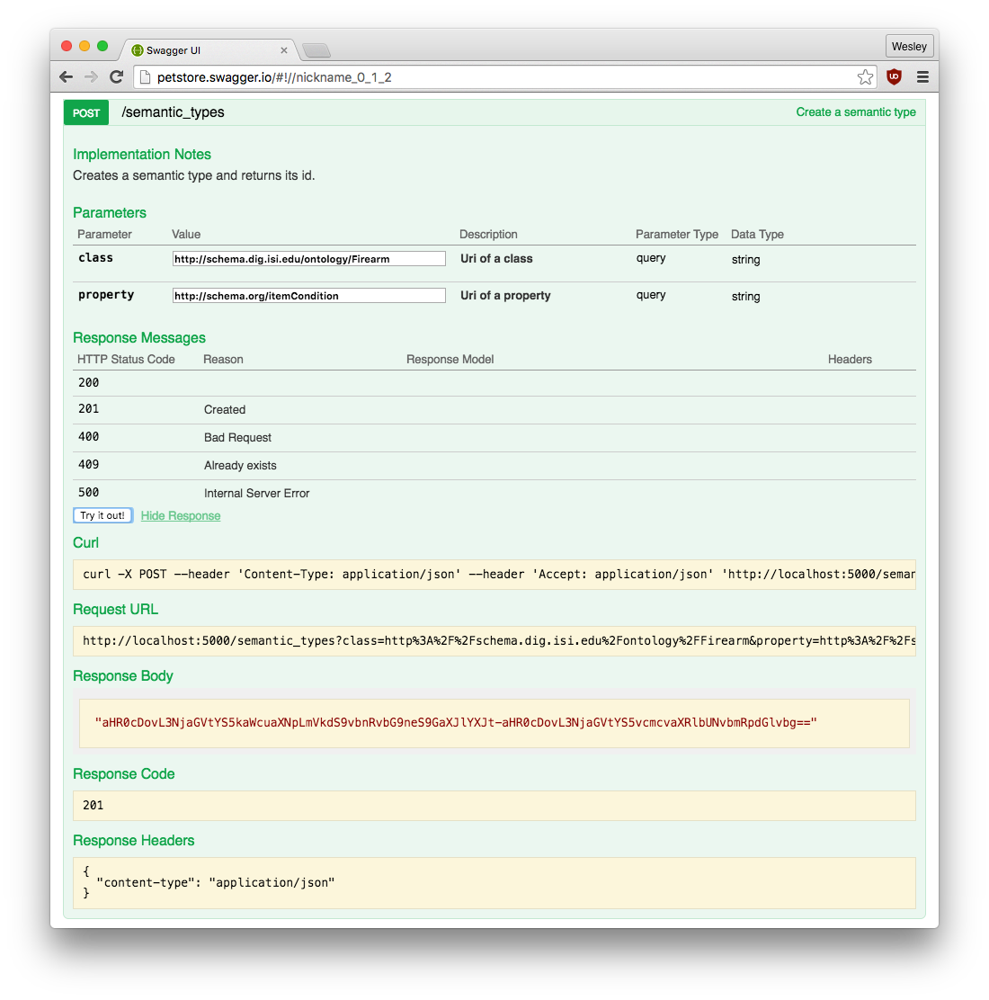
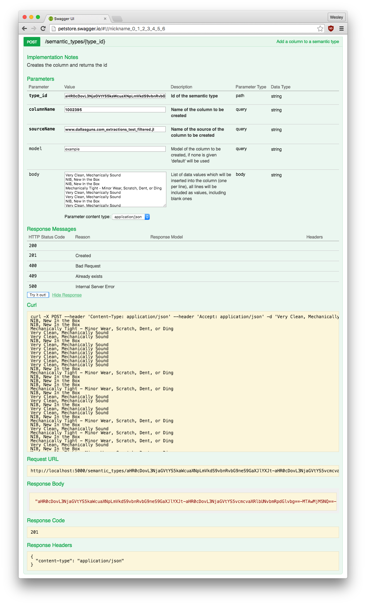
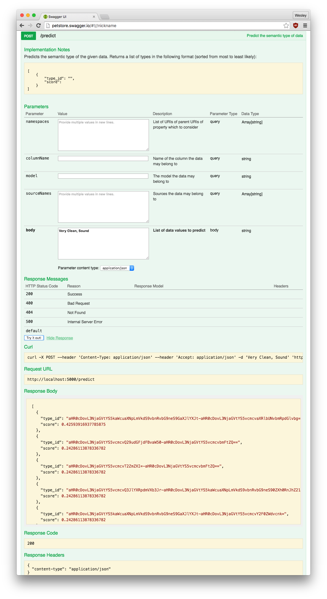
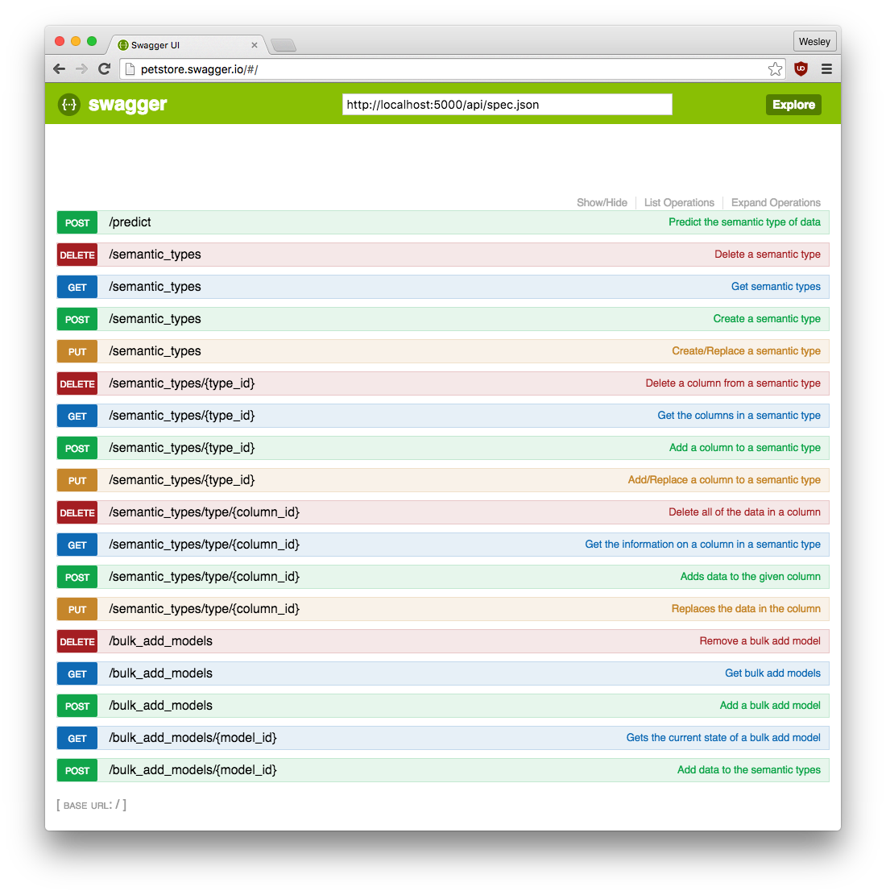

# Semantic Typing Service
Use this service to predict types of data after giving training data, see "Using the service" for details.

## Software Requirements
* Python 2.7 - [Download](https://www.python.org/downloads/)
	* Pip - If you're on Ubuntu just install "python-pip"

* MongoDB - If you're on Ubuntu just install "mongodb-server"

* Elasticsearch - [Download](https://www.elastic.co/downloads/elasticsearch)

* Apache Spark - [Download](http://spark.apache.org/downloads.html)
	* This can be a pain to get to work properly, you may find the sample code below to put in you `~/.bashrc` or `~/.bash_profile` helpful, just don't forget to change the two {{path to spark}} and {{version number}}:<pre>
export PATH={{path to spark}}/bin:$PATH
export SPARK_HOME="{{path to spark}}"
export PYTHONPATH=$SPARK_HOME/python:$SPARK_HOME/python/build:$PYTHONPATH
export PYTHONPATH=$SPARK_HOME/python/lib/py4j-{{version number}}-src.zip:$PYTHONPATH
</pre>

* SemanticLabeling - Install using "pip install git+https://github.com/usc-isi-i2/SemanticLabelingAlgorithm.git"

* Elastic2DocManager - Install using <pre>pip install elastic2-doc-manager</pre>  or <pre>
git clone https://github.com/mongodb-labs/elastic2-doc-manager
cd elastic2-doc-manager
python setup.py install
</pre>

* MongoConnector - Install using <pre>pip install mongo-connector</pre>  or <pre>
cd your/installation/directory
git clone https://github.com/mongodb-labs/mongo-connector.git
cd mongo-connector
python setup.py install_service
</pre>

## Running the service
1. Start MongoDB in replicaSet by running <pre>mongod --replSet "rs0"</pre> in the terminal
2. connect Mongo Shell to replicaSet by <pre>mongo</pre>
3. Initiate the replica set by <pre> 
rsconf = {
          _id: “rs0”,
          members: [
                     {
                      _id: 0,
                      host: “127.0.0.1:27017"
                     }
                   ]
        }
rs.initiate(rsconf)
</pre>
4. Start Elasticsearch by running the "elasticsearch" in "bin" in your elasticsearch directory
5. Create a connection between MongoDb and ElasticSearch using <pre>mongo-connector -m localhost:27017 -t localhost:9200 -d elastic2_doc_manager -v</pre>
6. You will probably not kill the process (ctrl+c) if you are deploying ES in the staging/production so you will need to create a background process to avoid losing the connection between your db and ES when you end the ssh session, to do that use - <pre>nohup mongo-connector -m localhost:27017 -t localhost:9200 -d elastic2_doc_manager -v > /dev/null 2>&1 & </pre>
    - For any queries with respect to steps 1-6, refer to this blog - https://madhacker.me/use-mongodb-and-elasticsearch-2/
7. Run "server.py"
	- If you get a "No module named pyspark" error your Apache Spark is not configured correctly
	- If you get a "No module named {package name here}" error just run "pip install {insert name here}" in terminal, just make sure pip is installing to the correct python installation if you have more than one

## Using the service
### Getting Started
Before you can predict what kind of data something is you have to create semantic types and columns with data in the semantic types.  The following diagram represents the relationship of the semantic types and columns in the service:

I recommend using swagger when you are trying the steps below for the first time since you have an explanation of what each parameter is right there.  There is a section on using swagger with this service below.

1. Create semantic types by using the `POST /semantic_types` with the class and property you want for the semantic type, just note that the class must be a valid URL which also has a valid namespace (parent) URL.  If you don't have any particular URL you want to use just make one up, if it isn't valid you'll get a 400 in response with a message that it isn't valid.
2. Create at least one column for each of the semantic types using the `POST /semantic_types/{type_id}` endpoint.  Keep in mind that you will need the semantic type's id for this; the id of the semantic type is returned when you create the type but you can also get them using the `GET /semantic_types` endpoint.  Even though you can create as many columns in a semantic type as you want, when you are predicting the service will only return the semantic type it thinks the data belongs to and no details about the column.  When you're first creating the column you do not have to add data, even though you do need to add data before predicting.  If you decide to create the column and add the data separately you can use the `POST /semantic_types/{column_id}` endpoint to add the data later.  When you give data to the service, remember that each line is taken as a value, including blank lines.
3. Now that you have semantic types and columns with data, you can use the `POST /predict` endpoint to predict the semantic type of the data.  When you give predict data, do it in the same format as adding the data. The more you provide the better.  The data you will get back from the service will be a list where each element contains the semantic type id and the how confident the semantic labeler is that the specific semantic type is the correct one for the given data, which ranges from 0 to 1.

#### Example
Only one of each step below is listed since each of them is exactly the same, just with different data.

1. Create a semantic type:

2. Create a column:

3. Predict semantic type:

### Quick summary of endpoints
##### `/predict`
__POST__ Use this for predicting the semantic type of data.  Without this endpoint this whole service is basically useless.

#####`/semantic_types`
__GET__ Returns all of the semantic types (and optionally the columns and data in the columns) in the system which match all of the given parameters.

__POST__ Add a semantic type.

__PUT__ Add a semantic type; it if already exists remove the old one and all of its data then make the new one.

__DELETE__ Delete all semantic types (and all of their data) which match all of the given parameters.

#####`/semantic_types/{type_id}`
__GET__ Return all of the columns (and optionally the data in the columns) in a semantic type which match all of the given parameters.

__POST__ Create a column in a semantic type, optionally with data.

__PUT__ Create a column in a semantic type, optionally with data; it if already exists remove the old one and all of its data then make the new one.

__DELETE__ Delete all of the columns in a semantic which match the given parameters.

##### `/semantic_types/type/{column_id}`
__GET__ Returns all of the information and data about the column.

__POST__ Append data to an existing column.

__PUT__ Replace the data in an existing column.

__DELETE__ Remove all of the data in the column.

##### `/bulk_add_models`
__GET__ Returns all of the bulk add models in the system which match all of the given parameters.  This can also be used to check the status of how well the labeler is working (using the "learnedSemanticTypes" in the model).

__POST__ Add a bulk add model.  The semantic types and columns in this model will be created now.

__DELETE__ Remove all of the bulk add models which meet all of the given parameters.

##### `/bulk_add_models/{model_id}`
__GET__ Get the bulk add model.  This is basically what you send when adding the model but it can have the learned semantic types updated.

__POST__ Add bulk amounts of data to the service.  This adds all of the data to the columns for you.

### Swagger
To view documentation for each of the endpoints and try it out with data, go to  `http://localhost:5000/api/spec.html#!/spec`.  For some reason it always starts with all of the endpoints hidden, so don't forget to click on "Show/Hide" or "List Operations".  Here is approximately what it should look like after listing all of the endpoints:

